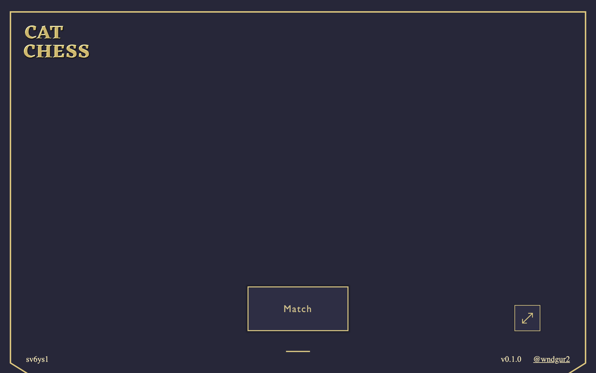
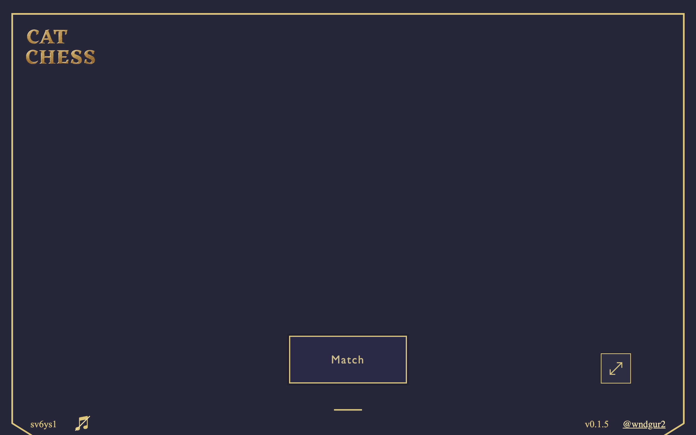
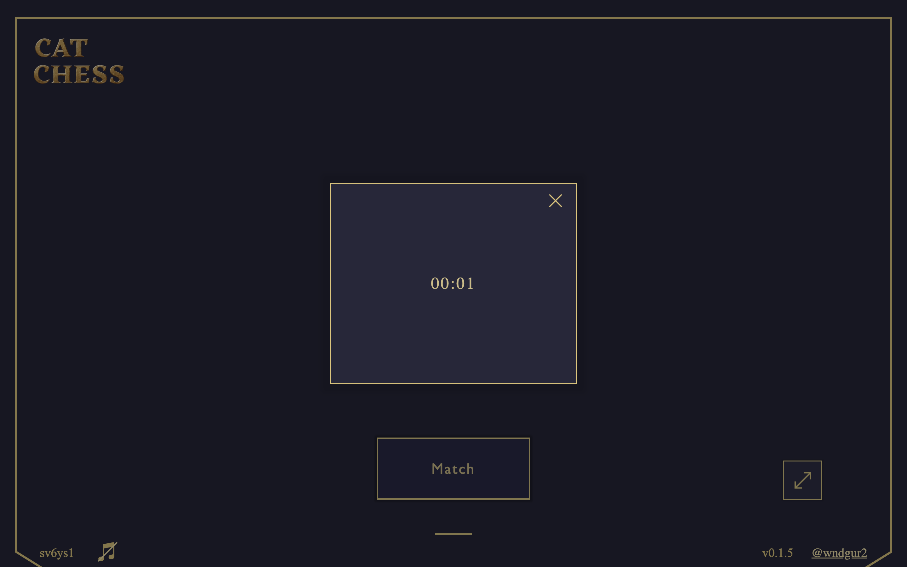

## 실시간 온라인 전략 웹 대전 게임

http://catchess.ap-northeast-2.elasticbeanstalk.com/

### Nodejs, Express, Three.js 사용

## 기록

### 12.1 Cat chess 3인 개발 시작

역할

-   이중혁: node.js로 backend 담당
-   유규빈: three js로 effect 구현 담당
-   오준묵: react js 로 frontend 담당

### 1.15 cat chess 1인 개발 시작

-   react에서 express로 프레임워크 변경  
    왜? (개발할 page가 많지 않아 spa에서 얻는 이득이 적고, 일반적인 웹 UI와 게임 UI가 요구하는 게 다르기 때문에 vanilla로 디테일하게 개발하기 위함)

## ~ commit 참고 ~

### 1.29 서버-클라이언트 통신 방식 개선 실패

-   unit을 참조할 때, 좌표 참조형 방식에서 unit.uid 참조형 방식으로 변경을 시도함.  
    -> client 측에서 game state에 따라 같은 unit을 다양한 목적으로 활용하고 있었다는 것을 간과함.  
    -> 한 인스턴스를 참조하게 되면서 다양한 목적을 하나의 인스턴스가 해결해야 하기 때문에 복잡한 코드가 마구 생겨버림.  
    -> 결국 처음에 의도한 간결한 알고리즘이 되지 않아 개선을 철회함.  
    -> 내일, client에서 같은 uid의 여러 Unit을 다루면서 서버와 클라이언트가 uid로 소통할 수 있게 개선해볼 예정.  
    배운 점: 많은 코드에 손이 가는, 통신 구조 변경과 같은 수정 사항은 그 여파를 고려해보고, 이 시스템을 처음 설계한 의도와 걸맞는지 판단한 후에 적용하기

이후 적절한 곳에 uid 사용하여 개선함

## ~ commit 참고 ~

### 2.11

DONE

-   아마존 배포.

TODO

-   기획, mesh, UI, sound

## ~ commit 참고 ~

### 2.26

로직은 웬만큼 다 한 것 같다. 스킬 제외

DONE

-   AWS 지역 스톡홀롬에서 서울로 변경: 응답 속도 개선(1초 이상 -> 거의 실시간)
-   Home 화면 UI 개선: frame, footer, "CAT CHESS" logo 등

TODO

-   modal UI 개선
-   in Game UI 개선

### 2.27

DONE

-   home UI 개선
-   modal UI 개선
-   modal close callback 구현

TODO

-   ingame UI 개선 (inventory)
-   ~~surrender 구현~~

### 2.29

DONE

-   ingame UI 설계 figma
-   inventory UI 개선

TODO

-   ingame UI 설계 확정 및 구현

### 3.1

DONE

-   ingame time, inventory UI 구현
    
    
    

TODO

-   ingame UI 개선(damage stastics, bottomWrapper, system btns)
-   Queens Gambit과 같은 Chess UX 구현 고민하기 (sound, visuality, functionality)

### 3.2

sound pixaby?

TODO

-   홈 화면 ambient sound

### 3.9

DONE

-   shopList UI 개선
    
-   source (coin / Poeir) 추가

TODO(big)

-   기획(item/cats)
-   스킬 구현
-   사운드 소스
-   메인 페이지 이미지 소스

### 3.10

DONE

-   home Card elements 초안
-   synergy UI
-   synergy 소스 변경
-   NODE_ENV 활용

TODO(big)

-   home 페이지 구현: Card Opener, 개요, Synergy 별 설명
-   Unit 기획
-   스킬 구현
-   사운드 소스

### 3.11

home Card opener 구현 중, cat img와 desc를 불러오기 위해서, 모든 CATS를 받아와야 함.  
이렇게 받아왔다면, Unit 인스턴스를 생성할 때, cat preset을 가져올 필요가 없음. (skill, synergies 등)

아니면 현재 방식을 유지하는 방법으로, Unit 인스턴스를 활용해서 Card Opener를 구현하는 방법이 있다.

DONE

-   Card opener 구현

TODO

-   home 페이지 구현: 개요, Synergy 별 설명

### 3.12

DONE

-   Card opener 마무리, home content( country desciption ) 아웃라인

TODO

-   시작 시, 모든 유닛 desc 받아오기

### 3.13

DONE

-   data fetching 단계 추가

### 3.14

TODO

-   description에 Unit cards 추가
-   Creep 설명 추가 (Other creatures?)

### 3.18

TODO

-   unit design
-   KOREAN

### 3.20

TODO

-   Source fetch loading
-   Therme Units
-   Item
-   Skill

### 3.21

TO LEARN in free time

-   js document

TODO

-   Threme Units << spellai coin 쌓이면
-   Unit detail design

DONE

-   Source fetch loading
-   인게임 UI 개선
-   게임 튜토리얼 작성

### 3.22

TODO

-   세계관 작성
-   DB 연결

-   MP bar
-   KOREAN
-   Push alarm
-   intersection observer
-   beacon

DONE

-   세계관 개요, Pado 도입부 작성

NOTE

-   시간에 쫓기는 게 좀.
